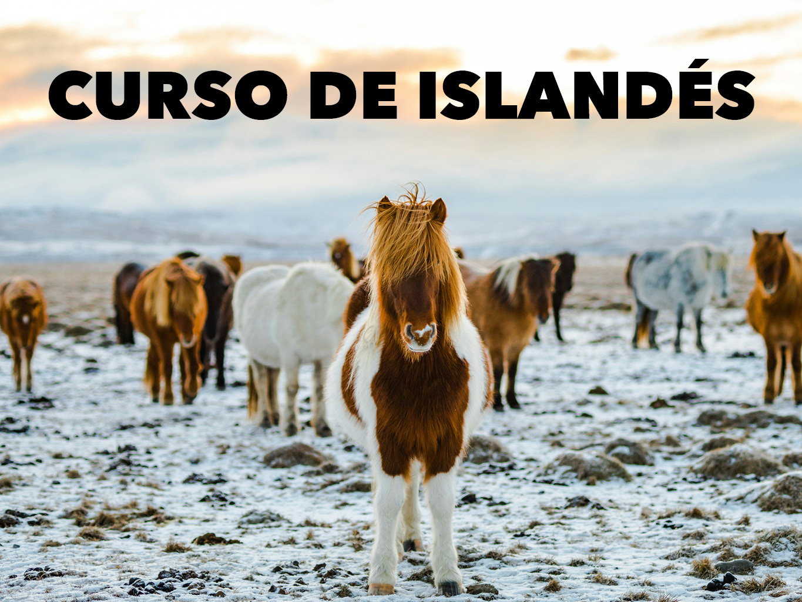
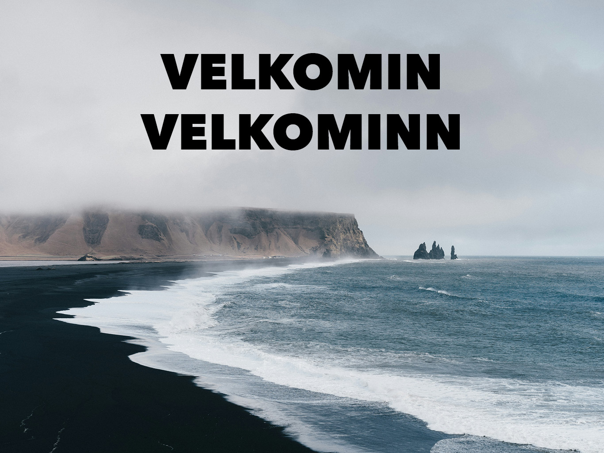

----------

# ¡Bienvenido/a al repositorio de mi curso de islandés! 

## Destinatarios
Este curso de iniciación está destinado a cualquier persona con interés en este idioma nórdico que no tenga conocimientos previos. 

## Duración del curso
180 minutos aproximadamente

## Objetivo general
Adquirir competencias básicas en islandés para comunicarse en situaciones cotidianas durante un viaje.

---
## Objetivos específicos
Después de este curso serás capaz de:
- Saludar y presentarte
- Decir de dónde eres y el nombre de algunos países
- Conocer las frases más útiles para el día a día
- Conocer los colores y números
- Utilizar frases básicas para viajar
- Conocer el vocabulario y frases para utilizar en un restaurante

---
# CONTENIDOS
## 1. TEORÍA-GRAMÁTICA
- ### U1. Hæ!
- ### U2. ¿De dónde eres?
- ### U3. Frases útiles
- ### U4. Colores
- ### U5. Números
- ### U6. De viaje
- ### U7. En el restaurante

---
## 2. EJERCICIOS
- ### Rellenar huecos
- ### Enlaces a ejercicios

---

## 3. CASOS GRAMATICALES Y DECLINACIONES (PRESENTACIÓN)
- ### Los cuatro casos gramaticales
- ### Declinaciones por género
- ### Características
- ### Ejemplos

---
## GUÍA DE VIAJES
Una pequeña guía de viajes para descubrir:
- ### Reikiavik
- ### Parques naturales
- ### Lagunas y piscinas geotérmicas
- ### Gastronomía

## 5. HISTORIA INTERACTIVA
Un español recién llegado a Islandia pierde un preciado objeto con el que no puede sobrevivir. 

¿Le ayudas a encontrarlo?

Por el camino se encontrará con pastores, ovejas, focas, pescadores y... 

---

