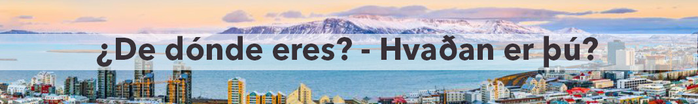

# EINING 2 - ISLENSKA

-  **2.1 Hvaðan er þú?** - *¿De dónde eres?*
-  **2.2 Að vera** - *Verbo "ser"*
-  **2.3 Löndum!** - *Países*

---------------------

## 2.1 Hvaðan er þú? - *¿De dónde eres?*

<video width="600" controls>
  <source src="img/de_donde_eres.mp4" type="video/mp4">
  Tu navegador no soporta la reproducción de videos.
</video>

## 2.2 Að vera - *Verbo "ser"*

| ÍSLENSKU     | ESPAÑOL             |
|--------------|---------------------|
| ég er        | yo soy              |
| þú ert       | tú eres             |
| hann er      | él es               |
| hún er       | ella es             |
| við erum     | nosotros somos      |
| Þið eruð     | vosotros sois       |
| Þeir eru     | ellos son           |
| Þær eru      | ellas son           |
| Þau eru      | son (hombre y mujer)|

-----------------------

## 2.3 Löndum - *Países*
Pincha [aquí](https://www.pinhok.com/es/kb/islandes/786/paises-en-islandes/) para saber cómo se pronuncian.

| ÍSLENSKU     | ESPAÑOL       |
|--------------|---------------|
| Ísland       | Islandia      |
| Spánn        | España        |
| Ítalía       | Italia        |
| Frakkland    | Francia       |
| Þýskaland    | Alemania      |
| Sviss        | Suiza         |
| Finnland     | Finlandia     |
| Austurríki   | Austria       |
| Grikkland    | Grecia        |
| Svíþjóð      | Suecia        |
| Pólland      | Polonia       |
| Bretland     | Gran Bretaña  |
| Rússland     | Rusia         |
| Kína         | China         |
| Japan        | Japón         |
| Bandaríkin   | EEUU          |
| Mexíkó       | México        |
| Suður-Afríka | Sudáfrica     |
| Marokkó      | Marruecos     |
| Ástralía     | Australia     |
| Nýja Sjáland | Nueva Zelanda |

-------------------------------