# ISLENSKA 1
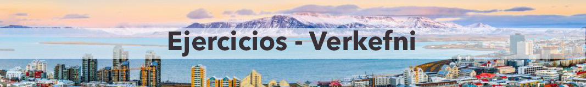

### Verkefni 1 - *Ejercicio 1*
#### Rellena los huecos.
- ................... daginn!
- Góðan daginn!
- Ég ................... Steiununn. Hvað ............. þú?
- Ég ................... Pierre.
- Hvað segirðu gott?
- Allt gott.
- Bless ...................
- ...............................

-------------
  
### Verkefni 2 - *Ejercicio 2* 
#### Rellena los huecos. 
- ................... daginn!
- ...................................!
- Ég ................... Þórhildur. Hvað ............. þú?
- Ég ................... María.
- Hvaðan er þú?
- Ég er frá Spáni. Og þú?
- ........................ frá Íslandi.

-------------

### Verkefni 3 - *Ejercicio 3* 

#### Hvaðan er/eru þau?

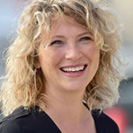 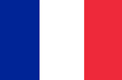

Hún ................. Cécile.
Hún ................. frá Frakklandi.

-------------

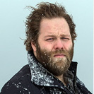 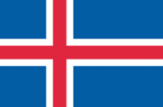

Hann ................. Ólafur Darri.
Hann ................. frá Íslandi.

-------------

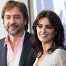 

Þau ................. Penélope og Javier.
Þau ................. frá Spáni.

-------------

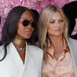 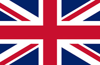

Þær ................. Ásta og Halla.
Þær ................. frá Bretlandi.

-------------

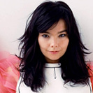 

Hún ................. Björk.
Hún ................. frá Íslandi.

-------------

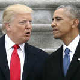 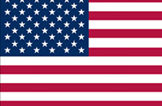

Þær .................. Barack og Donald.
Þeir ................. frá Bandaríkjunum.

-------------

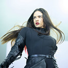 

Hún ................. Rosalía.
Hún ................. frá Spáni.

--------------